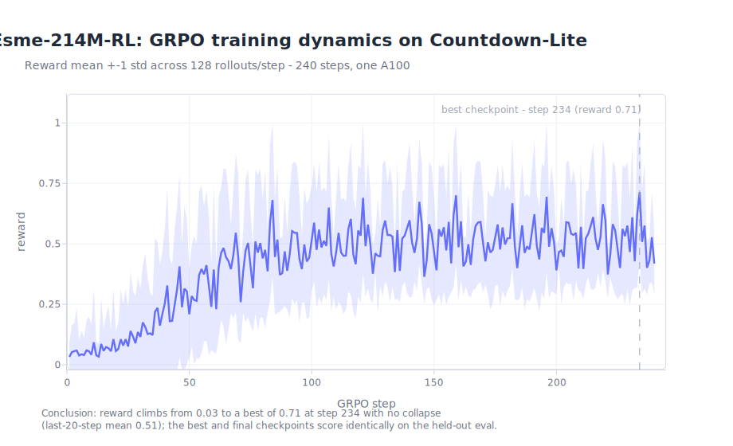
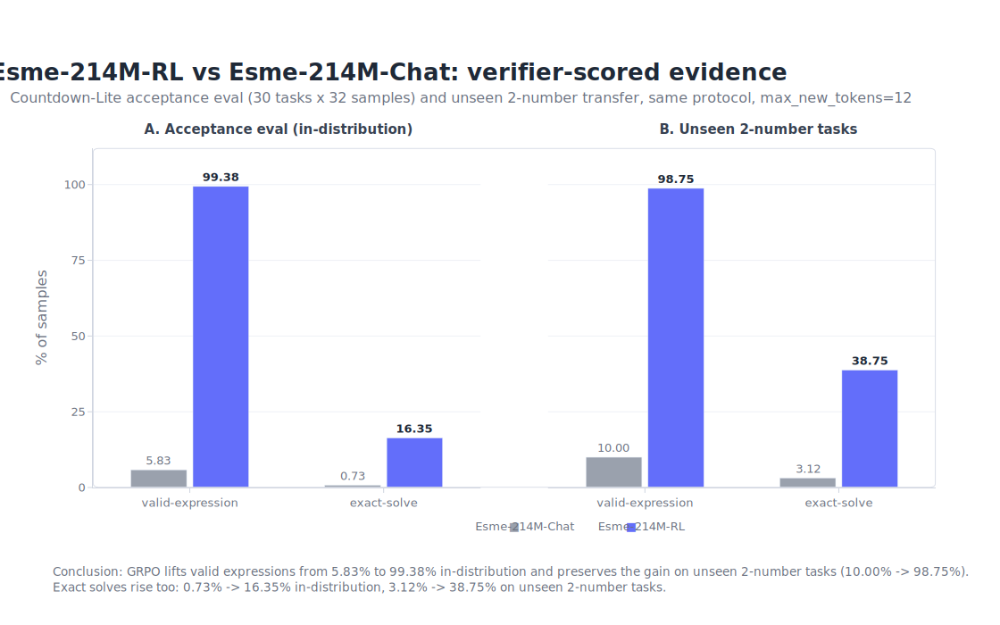
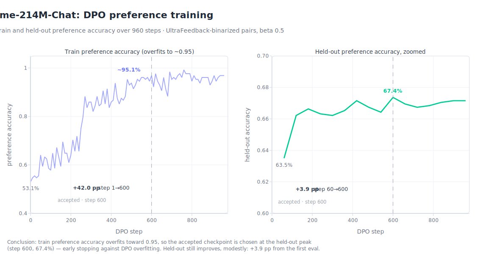

# esme-posttrain

Esme is a 214M-parameter language model trained from scratch. `esme-posttrain` adapts an `Esme-214M-Base` checkpoint from `esme-pretrain` into instruction-following, preference-tuned, and verifier-trained model artifacts.

The standard post-training path has three stages:

```text
Esme-214M-Base
  -> SFT:  Esme-214M-Instruct
  -> DPO:  Esme-214M-Chat
  -> RLVR: Esme-214M-RL
```

RLVR uses GRPO on the current Countdown-Lite verifier task.

## Stage Summary

1. **SFT** starts from `Esme-214M-Base` and produces `Esme-214M-Instruct`. It teaches chat format, turn-taking, and basic instruction following with the multi-turn SFT foundation.

2. **DPO** starts from `Esme-214M-Instruct` and produces `Esme-214M-Chat`. It prefers better answers over rejected answers without running on-policy RL. Chat export bundles are generated locally for downstream inference work.

3. **RLVR** starts from `Esme-214M-Chat` and produces `Esme-214M-RL`. It improves a task with verifier-backed rewards. Countdown-Lite GRPO is complete, with pass@1 at 16.67% and valid-expression rate at 35.73%.

The current RLVR target is Countdown-Lite: generate a short arithmetic expression that uses each supplied number exactly once and reaches the target. The reward is verifier-backed. Style rewards are intentionally out of scope.

## Why 214M?

Esme-214M is intentionally small for learning purposes. That makes the full LLM lifecycle easier to build, keeps iteration fast and costs low, and makes failures easier to diagnose, while still going through real training, evaluation, export, post-training, and inference.

## What Is Here

- Stage code for SFT, DPO, RLVR, launch validation, dense-bundle export, and shared artifact writing.
- Configs and schemas for the current Esme-214M post-training path.
- Evidence docs for SFT, DPO, and completed Countdown-Lite GRPO.
- Export tooling for `Esme-214M-Chat` bundles.

## Quickstart

```bash
uv sync --extra dev
uv run esme-posttrain --version
make check
```

Use `uv run ...` for Python commands. Default local commands do not download remote datasets, start Modal jobs, or spend money.

## Current Artifacts

- `docs/rlvr-countdown-lite.md` describes the RLVR task, baseline, and result.
- `docs/rlvr-countdown-lite-grpo.md` summarizes the completed Countdown-Lite GRPO run.
- `docs/rlvr-countdown-heldout-transfer.md` scores the RL and pre-RL checkpoints on held-out Countdown sets.
- Generated export bundles are written under gitignored `exports/`.
- Generated run reports are written under gitignored `artifacts/`.

## Training Telemetry

Static cards rendered from the accepted runs' Modal artifacts. GRPO reward
rises steadily over 240 steps with no collapse; the best and final
`Esme-214M-RL` checkpoints score identically.







To regenerate, fetch the run telemetry read-only from the Modal volumes and
re-render:

```bash
uv run --with modal==1.5.0 modal volume get esme-posttrain-esme-rlvr-countdown \
    esme-214m-rlvr-countdown-grpo-v2-ccb6287-1/rollouts.jsonl \
    runs/esme-214m-rlvr-countdown-grpo-v2-ccb6287-1/
uv run --with modal==1.5.0 modal volume get esme-posttrain-esme-rlvr-countdown \
    esme-214m-rlvr-countdown-grpo-v2-ccb6287-1/metrics.jsonl \
    runs/esme-214m-rlvr-countdown-grpo-v2-ccb6287-1/
uv run --with modal==1.5.0 modal volume get esme-posttrain-esme-rlvr-countdown \
    esme-214m-rlvr-countdown-grpo-v2-ccb6287-1/best-checkpoint.json \
    runs/esme-214m-rlvr-countdown-grpo-v2-ccb6287-1/
uv run --with modal==1.5.0 modal volume get esme-posttrain-esme-chat-dpo \
    esme-214m-chat-dpo-full/metrics.jsonl runs/esme-214m-chat-dpo-full/
uv run --with modal==1.5.0 modal volume get esme-posttrain-esme-chat-dpo \
    esme-214m-chat-dpo-full/best-checkpoint.json runs/esme-214m-chat-dpo-full/

uv run scripts/plot_run_telemetry.py --output-dir assets --json
```

The GRPO card derives per-step reward and rate curves from `rollouts.jsonl`
(240 steps x 128 rollouts) and cross-checks them against every logged
`metrics.jsonl` record and `best-checkpoint.json` before rendering. The
evidence card's bars are transcribed from the tables in
`docs/rlvr-countdown-lite-grpo.md` and `docs/rlvr-countdown-heldout-transfer.md`.

## Repository Layout

```text
src/esme_posttrain/
  cli.py              command-line entry point
  bundle.py           dense backbone bundle loading and hashing
  modeling.py         shared dense model primitives
  run_artifacts.py    shared JSON/environment/manifest artifact writers
  sft/                supervised fine-tuning stage
  dpo/                preference-tuning stage
  rl/                 verifier-reward RL stage
  launch/             shared launch validation
  training/           shared training runtime (collate, metrics, checkpointing)
  export/             dense bundle export
```

Stage-specific code belongs in the stage package. Keep the package root small.

## Related Repositories

These repositories exchange artifacts, not imports:

- [esme-pretrain](../esme-pretrain): trains base checkpoints from scratch.
- `esme-posttrain`: adapts base checkpoints with SFT, DPO, and RLVR.
- [llm-infer](../llm-infer): serves and benchmarks adapted checkpoints.
- `grpo-decomp`: studies where RLVR and GRPO gains come from.

## References

- Lambert et al., [_Tulu 3: Pushing Frontiers in Open Language Model Post-Training_](https://arxiv.org/abs/2411.15124), 2025.
- Chung et al., [_Scaling Instruction-Finetuned Language Models_](https://arxiv.org/abs/2210.11416), 2022.
- Rafailov et al., [_Direct Preference Optimization_](https://arxiv.org/abs/2305.18290), 2023.
- Shao et al., [_DeepSeekMath: Pushing the Limits of Mathematical Reasoning in Open Language Models_](https://arxiv.org/abs/2402.03300), 2024.
- Guo et al., [_DeepSeek-R1: Incentivizing Reasoning Capability in LLMs via Reinforcement Learning_](https://arxiv.org/abs/2501.12948), 2025.
- Wen et al., [_Reinforcement Learning with Verifiable Rewards Implicitly Incentivizes Correct Reasoning in Base LLMs_](https://arxiv.org/abs/2506.14245), 2025.
