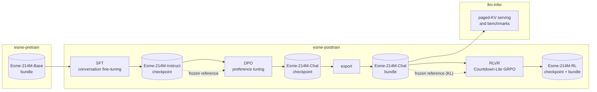
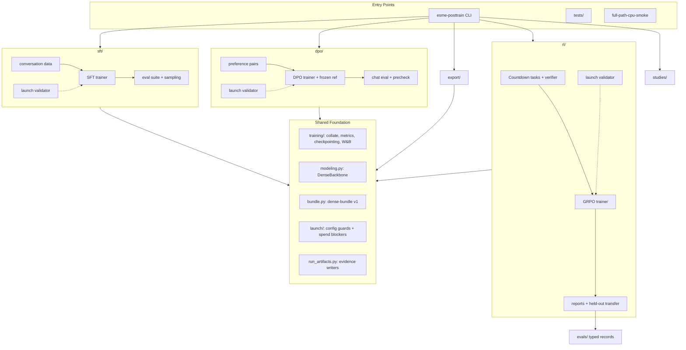

# Architecture

`esme-posttrain` turns the `Esme-214M-Base` bundle from `esme-pretrain` into
instruction-following, preference-tuned, and verifier-trained model artifacts.
The three stages — SFT, DPO, RLVR — are **sequential in artifact space and
parallel in code**: each stage consumes the previous stage's model, but the
stage packages are siblings with the same internal shape, standing on one
shared training runtime and one dense backbone.

## Stage Pipeline

Every solid arrow is an artifact handoff — a checkpoint or a dense bundle,
never a code import. Dashed arrows are frozen-reference anchors.



Reading the pipeline:

- SFT teaches chat format on conversations with all-assistant masking; a
  single-turn instruction row is simply a two-message chat.
- DPO warm-starts from the SFT checkpoint and scores its loss against that
  same checkpoint as a frozen reference.
- Export packages the DPO checkpoint as a dense bundle. The bundle — not the
  raw checkpoint — is what RLVR consumes and what `llm-infer` serves.
- GRPO trains against the Countdown-Lite verifier reward with a KL penalty
  toward the frozen Chat policy it started from.

So each stage after SFT is anchored to the model it started from: the previous
stage's artifact is both the warm start and the regularization target. Each
handoff also has an acceptance gate, recorded in the matching run card under
[`run_cards/`](../run_cards/).

### Two Artifact Regimes

The handoffs are not all the same kind, and the difference is deliberate:

- **SFT → DPO is a checkpoint handoff.** DPO is SFT-shaped training: offline,
  teacher-forced forward passes over fixed preference pairs, on the same
  collate/checkpoint/scheduler/metric infra. It consumes the SFT training
  checkpoint directly — `sft_reference` in
  [`configs/esme-214m-chat-dpo.json`](../configs/esme-214m-chat-dpo.json)
  pins `best-checkpoint.pt` plus tokenizer with format
  `llm_posttrain_instruct_sft_v1`.
- **DPO → RLVR is a bundle handoff.** GRPO is on-policy: the model generates
  completions inside the training loop and the verifier scores them. That
  needs a complete runnable model — weights, tokenizer, EOS conventions,
  config — which is what the dense bundle packages and what export's
  generation smoke proves. RLVR therefore consumes the same artifact type
  `llm-infer` serves.

Export marks the transition from "continue training this run" to "run this
model". The model enters the repo as a bundle, moves between the supervised
stages as a checkpoint, and returns to bundle form at export — where GRPO
and inference both pick it up.

## Runtime Map

In code the stages are parallel. Each stage package has the same anatomy —
data path, launch validator, trainer, evaluation — and all three trainers run
the same `DenseBackbone` on the shared training runtime. Dashed edges are
launch gates; solid edges are data and dependency flow. The two cross-stage
imports (`dpo -> sft`, `studies -> rl`) are listed in the dependency block
below instead of drawn, so the three stage columns stay side by side.



There is one deliberate cross-stage import: `dpo/` reuses the SFT chat
template and sampling so the DPO policy sees exactly the format the SFT
foundation was trained on. `rl/` writes its eval outputs through the typed
records in `evals/`, whose serialized shapes are pinned by golden fixtures.

## Module Ownership

| Module | Owns | Does not own |
| --- | --- | --- |
| [`sft/`](../src/esme_posttrain/sft/) | conversation data with all-assistant masking, SFT trainer, launch validation, eval suite, sampling | preference pairs, rewards |
| [`dpo/`](../src/esme_posttrain/dpo/) | preference pairs, vanilla DPO trainer with frozen SFT reference, decoding precheck, chat eval, launch validation | the chat template (rendered by `sft/data`) |
| [`rl/`](../src/esme_posttrain/rl/) | Countdown-Lite task generation and verification, GRPO trainer, baselines, held-out transfer, reports, launch validation | a task registry or plugin framework |
| [`evals/`](../src/esme_posttrain/evals/) | typed records for the eval contract, shapes pinned by golden fixtures | scoring logic |
| [`training/`](../src/esme_posttrain/training/) | collate, metrics, checkpointing, seeding/precision, W&B init | stage objectives |
| [`launch/`](../src/esme_posttrain/launch/) | shared config guards, spend blockers, Modal CLI shell, full-path CPU smoke | stage recipes (each stage's launch module pins its own) |
| [`export/`](../src/esme_posttrain/export/) | adapted dense-bundle export with manifest and generation smoke payload | serving (that is `llm-infer`) |
| [`studies/`](../src/esme_posttrain/studies/) | hashed study specs and rebuilt JSON/Markdown reports | running training |
| [`modeling.py`](../src/esme_posttrain/modeling.py) | the shared `DenseBackbone` model primitives | tokenization, training loop |
| [`bundle.py`](../src/esme_posttrain/bundle.py) | dense-bundle v1 validation, loading, hashing | the format spec (`esme-pretrain/docs/bundle-format.md`) |
| [`run_artifacts.py`](../src/esme_posttrain/run_artifacts.py) | env capture, manifests, JSON evidence writers | stage-specific payloads |
| [`cli/`](../src/esme_posttrain/cli/) | command surface, payload emission, exit codes | stage logic |

Dependency direction stays simple:

```text
cli / tests / full-path smoke -> sft + dpo + rl -> training + modeling + bundle + launch guards
dpo -> sft        (chat template, sampling)
rl -> evals       (typed eval records)
studies -> rl     (Countdown-Lite spec)
export -> bundle + training checkpointing
```

## Launch Contract

Each stage owns an approval-gated launch validator:
[`sft/launch_multiturn.py`](../src/esme_posttrain/sft/launch_multiturn.py),
[`dpo/launch.py`](../src/esme_posttrain/dpo/launch.py),
[`rl/launch.py`](../src/esme_posttrain/rl/launch.py). They share one contract:

- Dry-run never starts Modal and spends nothing.
- Smoke paths are spend-capped (the DPO smoke pins $2 with no environment
  bypass).
- A full run refuses while unapproved or while any launch blocker is
  outstanding, and carries a hard per-stage spend cap.
- The validator pins the recipe — run id, volume, output stem, data mix,
  hyperparameters — so config drift fails loudly before any spend.

The validators are the single source of truth for config shape: configs,
fixtures, and CLI dry-run payloads change together with them.

## Bundle Contract

Dense-bundle v1 is the interchange format everywhere: in from `esme-pretrain`,
out to `llm-infer`, and between DPO and RLVR inside this repo.
[`bundle.py`](../src/esme_posttrain/bundle.py) validates, loads, and hashes
bundles; [`export/dense_bundle.py`](../src/esme_posttrain/export/dense_bundle.py)
writes them with a manifest and a generation smoke payload. The format spec
lives in `esme-pretrain/docs/bundle-format.md`; this repo does not keep a
parallel copy.

## Full-Path CPU Smoke

`esme-posttrain full-path-cpu-smoke` runs the whole chain locally with no
spend and records every artifact handoff
([`launch/full_path_smoke.py`](../src/esme_posttrain/launch/full_path_smoke.py)):

1. Validate the base bundle contract.
2. Run a tiny SFT fixture.
3. Run DPO interrupted mid-training, resume it, and check the result equal
   against an uninterrupted control.
4. Export the DPO artifact as a dense bundle.
5. Re-validate the exported bundle contract.
6. Run the RLVR pipeline smoke on that bundle: generation plus verifier
   scoring.

This is the cheap proof that the stage seams still fit before any GPU run.

## Read Next

1. [package-layout.md](package-layout.md) — where code goes and import rules.
2. [`run_cards/`](../run_cards/) — per-stage budgets, data, and acceptance
   gates.
3. [rlvr-countdown-lite.md](rlvr-countdown-lite.md) — the RLVR task, baseline,
   and result.
4. [study-reports.md](study-reports.md) — reproducible study reports.
