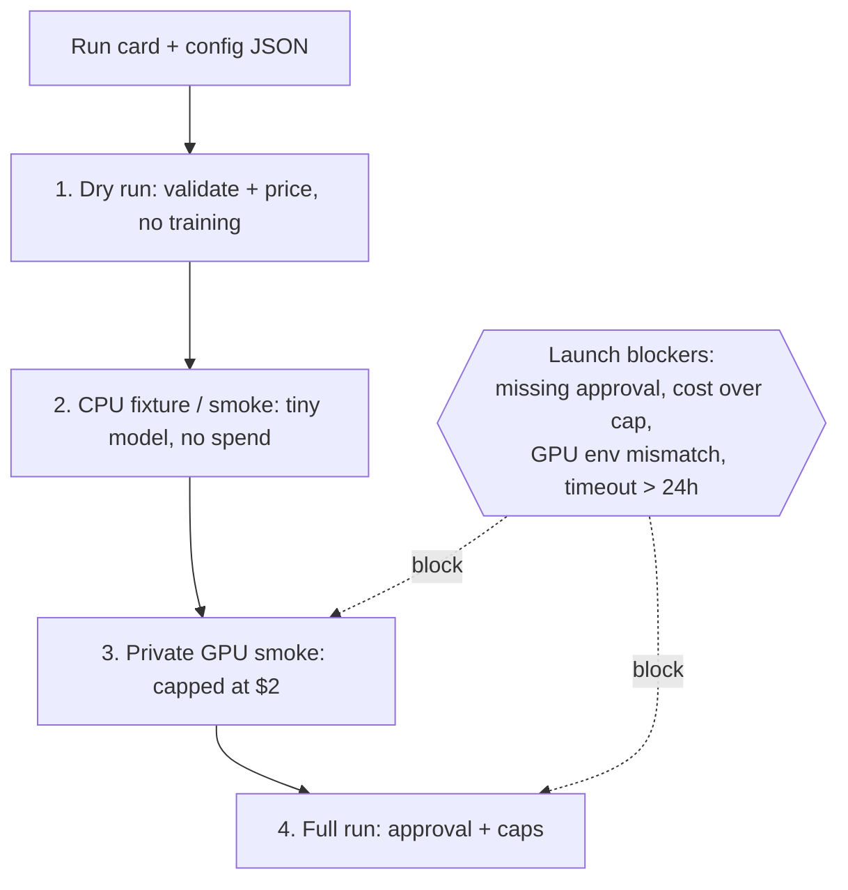
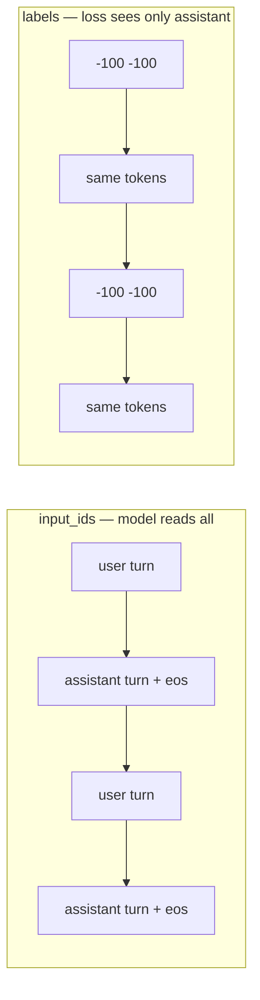
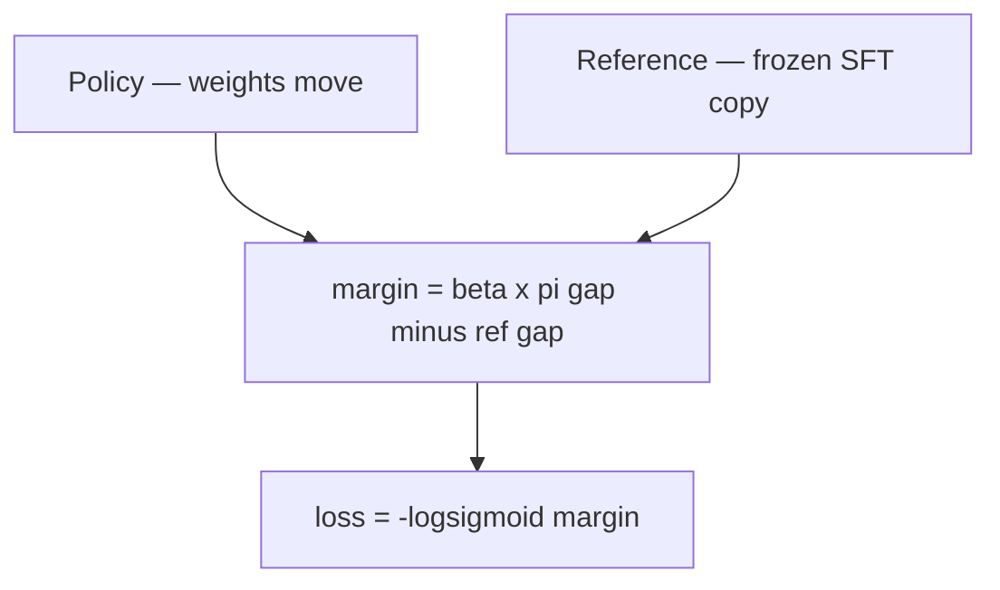
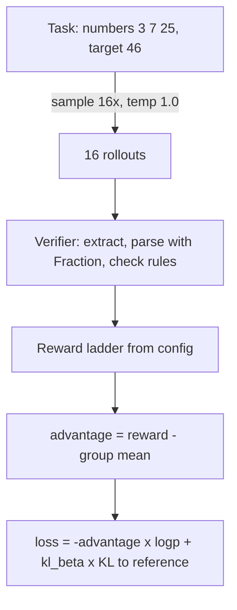
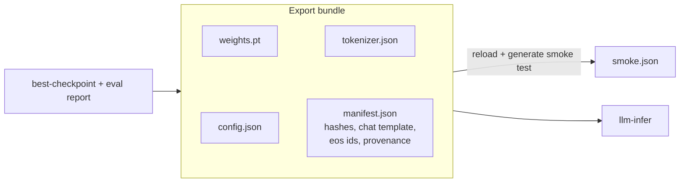

# Repo Study Notes

A guided-tour summary of how `esme-posttrain` works: the run lifecycle, the three
training stages, export, and the design themes that repeat everywhere. Written as
onboarding notes; the authoritative details live in the linked code and docs.

## The One-Sentence Version

This repo takes a 214M-param from-scratch base model and pushes it through three
training stages — imitate (SFT), prefer (DPO), explore (GRPO) — under strict spend
controls, leaving a hashed evidence trail at every step, and ships the result as a
self-describing four-file bundle to `llm-infer`.


## The Run Lifecycle

Every stage follows the same ladder. Code: `src/esme_posttrain/launch/config_guards.py`.



Key points:

- The config is a contract, not a settings file: it names its run card, budgets,
  and baseline metrics (see `configs/esme-214m-rl.json`). Stop conditions live in
  code and enforced config numbers, not prose.
- Two distinct failure modes: a raised `LaunchError` means the config is malformed
  (unknown keys, wrong types); a returned `launch_blockers` list means the config is
  valid but not allowed to spend (missing approval, projected cost over cap).
- Spend caps are hardcoded in Python (`SMOKE_SPEND_CAP_USD = 2.0`); a config cannot
  override them. The dry-run prices the worst case up front so operators do not
  hand-compose spend commands.

## Stage 1: SFT (Base -> Instruct)

SFT is next-token prediction with a mask. Core: `tokenize_multi_turn` in
`src/esme_posttrain/sft/data.py`.



- Assistant tokens get real labels; user/system tokens get `-100` (`IGNORE_INDEX`) —
  read as context, excluded from loss. The model learns one role: produce a good
  assistant turn.
- The appended `eos` per assistant turn teaches stopping — half of what "chat
  format" means.
- Train loss trains; held-out loss selects. `best-checkpoint.pt` (lowest eval
  selector loss) is what ships, not the final step. The `no_robots` split is an
  OOD tripwire that crashes training on catastrophic regression.
- Every rejected data row is counted by reason (`SourceSurvivorCounts`); every
  failure writes `failure-report.json`. Runs are auditable after the fact.

## Stage 2: DPO (Instruct -> Chat)

DPO is logistic regression on answer pairs. Same next-token machinery, different
loss. Core: `dpo_pair_loss` and `sequence_logprob` in `src/esme_posttrain/dpo/trainer.py`.

```text
loss = -log sigmoid( beta * [ (logp_pi(chosen) - logp_pi(rejected))
                            - (logp_ref(chosen) - logp_ref(rejected)) ] )
```



- The frozen reference (a copy of Instruct) is the anchor: credit only for
  preferring chosen more than the SFT model already did. `beta` is the leash length.
- Contrastive, not absolute: it learns only from the difference between two answers.
- Two named, defended failure modes: verbosity reward-hacking (`length_normalized`
  divides logp by supervised token count) and likelihood displacement
  (`is_chosen_logp_collapsed`, Razin et al. 2024, relative 1% threshold justified
  against ~0.03% eval jitter).

## Stage 3: RLVR / GRPO (Chat -> RL)

The data direction flips: the model learns from its own attempts, scored by a
verifier. Core: `run_countdown_lite_grpo` in `src/esme_posttrain/rl/grpo.py` and
`verify_countdown_lite_expression` in `src/esme_posttrain/rl/countdown_lite.py`.



- The verifier is a plain deterministic Python function — extract candidate, parse
  with a hand-written parser (`Fraction` math, never `eval`), check each number used
  exactly once and the integer result. It outputs facts; the config maps facts to
  rewards. No judgment call exists at runtime.
- Reward ladder: garbage 0.0, well-formed 0.05, valid 0.3 + closeness bonus
  (`weight * exp(-|value - target| / target)`, max 0.3), exact solve 1.0. The rungs
  keep gradients alive when exact solves are rare.
- GRPO's trick: the group is the critic. `advantage = reward - group mean`
  (Dr. GRPO, no std division — std normalization blows up exactly when a group is
  uniform and uninformative). No value network.
- One gradient step per rollout batch, so the update is REINFORCE-with-baseline
  plus a KL leash to a frozen reference — the code comment says so plainly.
- Zero-signal countermeasures: zero-variance resampling, a success replay buffer
  (splice a recent success into all-failed groups), stratified difficulty sampling.
- Result (run `caff0a1`): valid-expression rate 2.7% -> 99.4%, pass@1 3.3% -> 16.7%.

## Export (RL -> llm-infer)

A model artifact is weights + tokenizer + prompt contract + provenance. Core:
`export_dense_bundle` in `src/esme_posttrain/export/dense_bundle.py`.



- Four files: `weights.pt`, `config.json`, `tokenizer.json`, `manifest.json`. The
  manifest carries the chat template (`esme_newline_v1`) and `eos_token_ids` — the
  operating instructions SFT baked in. Format prompts differently downstream and
  the model silently degrades.
- Export refuses incomplete inputs (no eval report, no export), writes atomically,
  hashes every file, then reloads its own output and generates before declaring
  success.
- Provenance nests: the RL manifest embeds the Chat manifest, which points to DPO
  step 600 and its training run — full ancestry, verifiable offline from one JSON
  file.
- Sibling repos exchange artifacts, never imports; `llm_pretrain_dense_v1` is the
  API version between them.

## Cross-Cutting Themes

1. **One primitive underneath everything**: a next-token predictor. The stages
   differ only in which loss shapes the token probabilities — which is why
   `sequence_logprob`, the `-100` masking, and the shared `training/` collate /
   checkpoint / runtime code appear in all three stage packages.
2. **Two recurring leashes**: a frozen reference model (DPO structurally, GRPO via
   KL penalty) and hard budgets that raise loudly mid-run.
3. **Nothing spends by accident**: run cards, approval gates, hardcoded caps,
   dry-runs that price the worst case.
4. **Evidence over vibes**: `metrics.jsonl`, data reports, survivor counts, failure
   reports, manifests with hashes — every run can be audited without having
   watched it.
5. **Structure mirrors the pipeline**: stage packages (`sft/`, `dpo/`, `rl/`) with
   identical skeletons (data -> trainer -> launch -> smoke -> full) on shared infra
   (`launch/`, `training/`, `export/`), boring `__init__.py` files, canonical
   import paths.

## Pocket Version

| Stage | Learns from | Loss says |
| --- | --- | --- |
| SFT | demonstrations | "imitate this" |
| DPO | preference pairs | "prefer this over that, vs reference" |
| GRPO | own attempts + verifier | "do more of what beat your own average" |

## Related Docs

- `README.md` — current stage summary and telemetry cards.
- `docs/package-layout.md` — canonical package and import rules.
- `docs/internal/instruct-sft-recipe.md` — the Instruct SFT recipe in full.
- `docs/rlvr-countdown-lite-grpo.md` — the accepted GRPO run evidence.
